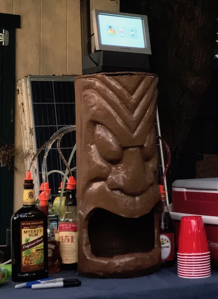
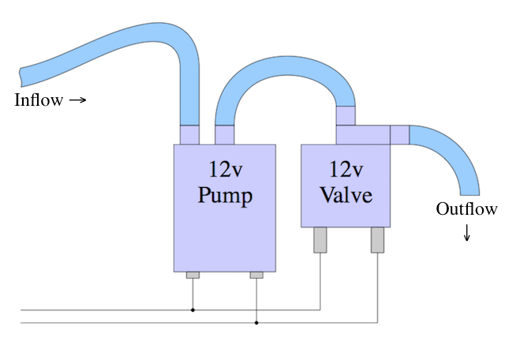
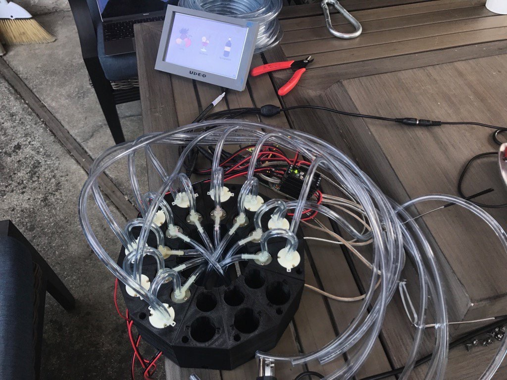

TikiBot
=======
Touchscreen BarBot software for auto-dispensing mixed drinks.  Runs under
Linux on a Raspberry Pi or Udoo, using DC motor controllers over I2C, to
activate pumps and valves to dispense ingredients.

TikiBot Lives!  It was a great success at my friend's Tiki themed party.

Standard Drinks List
--------------------
The default configuration is for a 12-feed TikiBot.
It expects the following ingredient feeds:

1. Meyer's Dark Rum
2. Appleton's Signature Blend
3. Meyer's Platinum White Rum
4. Lemonheart 151 Rum
5. Lime Juice
6. Lemon Juice
7. Orange Juice
8. Pineapple Juice
9. Passion Fruit Syrup
10. Sugar Syrup
11. Angostura Bitters
12. Grenadine

The following Tiki recipes can be made from those:

1. Beachcomber's Gold
2. Chief Lapu Lapu
3. Hurricane
4. Planter's Punch
5. Shrunken Skull
6. Tiger Shark
7. Trader Vic Grog
8. Zombie

The following non-alcoholic juice drinks can also be made:

1. Orange Juice
2. Pineapple Juice
3. Pineapple Orange Juice
4. Tropical Punch

Hardware
--------
This software has been tested with the following hardware:

- Udoo Neo ( [source](https://www.udoo.org) )
- 7" 800x480 Touchscreen HDMI display
- 3 Adafruit DC Motor Featherwings ( [source](https://www.adafruit.com/product/2927) )
- 12 Small self-priming pumps ( [source](http://www.trossenrobotics.com/robotgeek-pump-small) )
- 12 Normally Closed solonoid valves ( [source](https://www.amazon.com/dp/B007D1U64E/ref=cm_sw_r_tw_dp_x_qDVWzbPCEW4K5) )

Each DC Motor controller handles up to 4 feeds.  Each motor controller will
need to have a consecutive different I2C address. You can alternately use
the following DC motor controllers without changing any code:

- Adafruit DC & Stepper Motor HAT for Raspberry Pi ( [source](https://www.adafruit.com/product/2348) )
- Adafruit Motor/Stepper/Servo Shield for Arduino v2 ( [source](https://www.adafruit.com/product/1438) )

It should be trivial to use a Raspberry Pi instead of the Udoo Neo.
Probably the easiest configuration would be to use a Raspberry Pi
with a few stacked DC Motor HATs.

Each feed is a paired pump and valve, wired in parallel.
Each pump/valve combo should be wired and plumbed as follows:

The polarity of the wiring is irrelevant for the linked pumps and
valves.  For them, either polarity will result in the forward pump
action with the valve open.

The pumps-valve pairs can be seated into a ring of Pump Wedges that can
be 3D printed from the model `STLs/PumpWedge12.stl` (for a 12 feed ring)
or `STLs/PumpWedge16.stl` (for 16 feed rings).  A corresponding Feed Guide
model can be found as `STLs/FeedGuide12.stl` or `STLs/FeedGuide16.stl`.
The feed guide has a slot in the bottom that can hold a funnel for all
the feeds to pour and mix into, which will drain into the target glass
or cup.

Installation
------------

    unzip TikiBot.zip
    cd TikiBot
    pip3 install -r requirements.txt

Running TikiBot
---------------
`gui.py` is the main file to run to launch this application.  You will
need to run it using Python 3.6 or better.

     cd TikiBot/TikiBot
     python3 gui.py

Configuration Files
-------------------
The file `TikiBot/resources/tikibot_configs.yaml`: Contains all configs
for passcode, feeds, recipes, etc. for a standard set of Tiki drinks.
On first run, if you edit any configs on the configuration screen,
these configs will be written out to the file `$HOME/.tikibot.yaml`,
which will be read in all future runs.

In the lower right corner of the main screen is a gear icon.  This is
the configuration menu button. If you press it, it will ask for an
administrative passcode.  The default is '8888'.  Once you enter the
correct passcode, you will be shown the configuration screen.  From
here, you can change the passcode (recommended!), add, edit and re-order
feeds, add, and edit drink recipes, and shutdown or reboot the system.
Any changes made here will be saved to the `$HOME/.tikibot.yaml` file.

Screens Layout
--------------
Here's the hierarchy of GUI screens for the application.  The button
name that leads to a screen is in "quotes".  If a screen is a
subclass of another screen class, the base class is in (parens).

    MainScreen
        "Juices" RecipeScreen(SelectScreen)
            PourScreen
                "Pour" DispensingScreen
        "Tiki Drinks" RecipeScreen(SelectScreen)
            PourScreen
                "Pour" DispensingScreen
        "By Ingredient" ByIngredientScreen(SelectScreen)
            PourScreen
                "Pour" DispensingScreen
        "⚙" LockScreen
            ConfigScreen
                "Manage Feeds" ManageFeedsScreen(SelectScreen)
                    "+" AlphaScreen
                    FeedScreen
                        "Delete Feed" SelectScreen
                        "Rename Feed" AlphaScreen
                        "Calibrate" CalibScreen
                "Manage Recipes" ManageRecipesScreen(SelectScreen)
                    "+" AlphaScreen
                    RecipeEditScreen
                        "Recipe:" AlphaScreen
                        "Category:" AlphaScreen
                        "+" SelectScreen
                        "-" SelectScreen
                        "✎" AmountScreen
                "Dump All Feeds" DumpScreen
                "Change Passcode" LockScreen
                    NotifyScreen
                "Shutdown" ShutdownScreen

